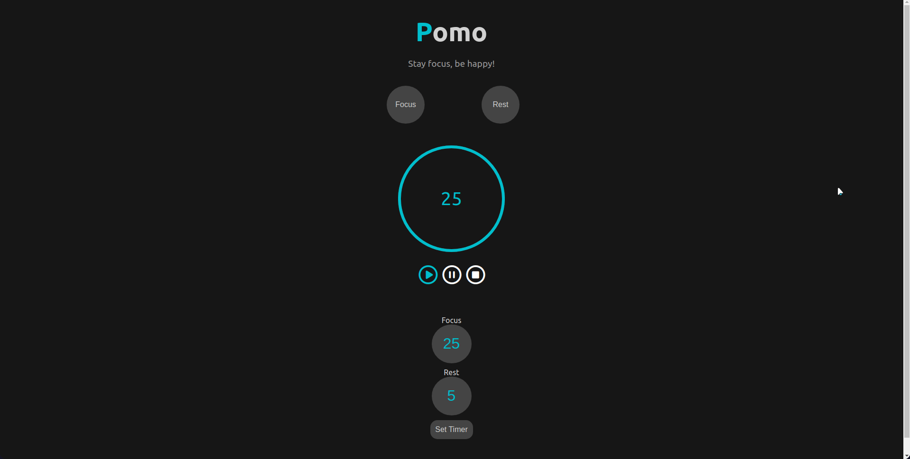

# Pomo - Pomodoro App

App pomodoro desenvolvido como parte do processo seletivo da VilaApps.

 

## Preview 📺

 

 

## Tecnologias utilizadas 🛠

* ReactJs
* React Hooks
* HTML
* css

 

## Lições aprendidas 📚
* Como funciona um pomodoro;
* Reforcei conhecimentos em ReactJs e JavaScript;
* Reforcei conhecimentos com React Hooks;
* Aprendi a utilizar useSound, um React Hook para criar efeitos sonoros;
* Aprendi a utilizar o React Countdown Circle Timer, um componente React/React Native que adiciona um contador personalizável e otimizado;

 

## Quer testar o app? 🎮

Live application: https://pomo-vilaapps.netlify.app/

 

## Quer ver o código-fonte? 🧐 💻

### No terminal escreva os seguintes comandos:
 

* Clone o repositório: git clone git@github.com:LucasSilvaMarts/Pomo.git
* Entre no diretório: cd Pomo
* Abra com o seu editor favorito, ex: code .
* Instale as dependências: npm install
* Rode o app: npm start
